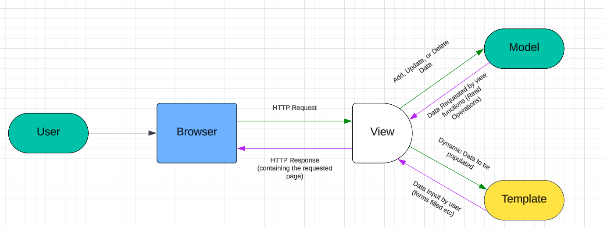
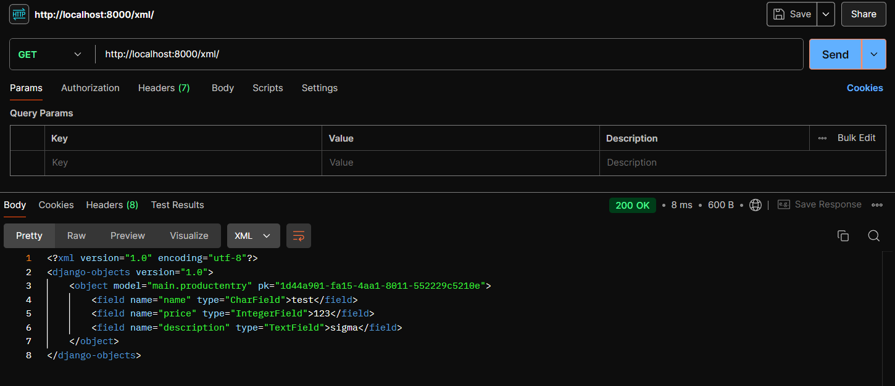
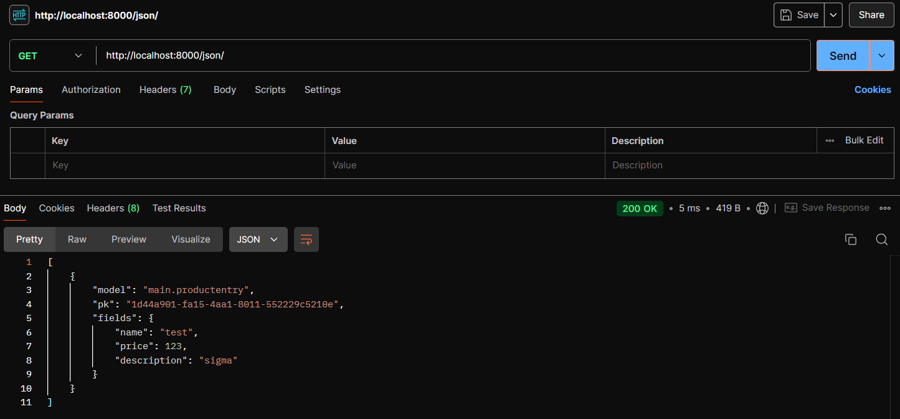
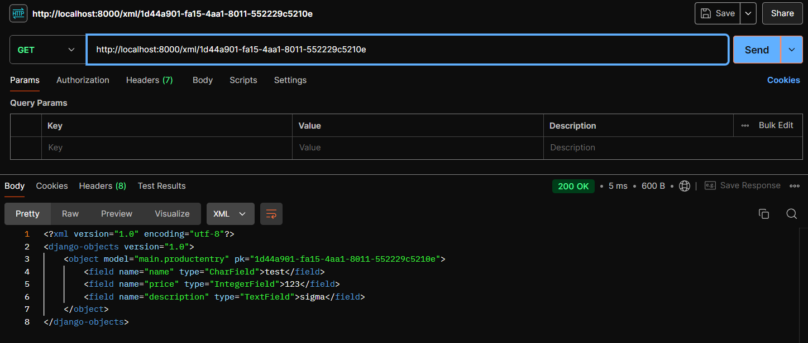
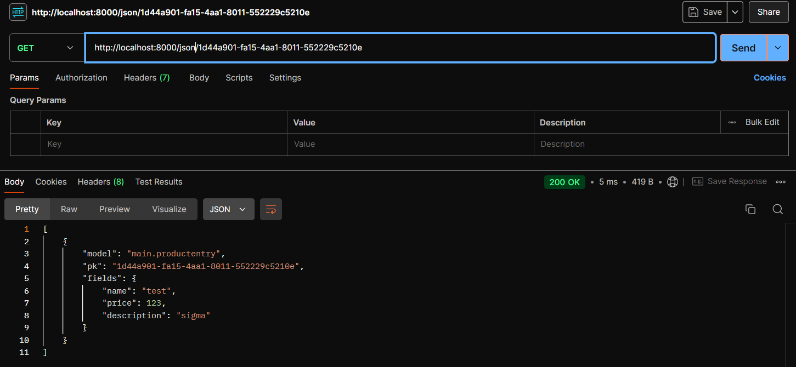

# not-indomaret

# ---TUGAS 2---

## Jelaskan bagaimana cara kamu mengimplementasikan checklist di atas secara step-by-step (bukan hanya sekadar mengikuti tutorial).
### Membuat sebuah proyek Django baru
1. Membuat direktori baru untuk proyek Django baru.
2. Buka command prompt di direktori tersebut dan jalankan perintah `python -m venv env` untuk membuat virtual environment untuk Python. Environment akan mengisolasi package dan *dependencies* dari aplikasi sehingga tidak konflik dengan versi lain.
3. Mengaktifkan virtual environment dengan menjalankan perintah `env\Scripts\activate.bat` (windows).
4. Buat file dengan nama `requirements.txt` di direktori yang sama dan isi dengan *dependencies* berikut:
`django`
`gunicorn`
`whitenoise`
`psycopg2-binary`
`requests`
`urllib3`
5. Install *dependencies* dengan perintah `pip install -r requirements.txt` dengan virtual environment menyala.
6. Membuat proyek Django dengan nama yang diinginkan melalui perintah `django-admin startproject not-indomaret .`
7. Buka kembali command prompt dan jalankan perintah `python manage.py runserver` dan buka http://localhost:8000 untuk melihat apakah aplikasi Django berhasil dibuat.
8. Hentikan server dengan menekan `Ctrl+C` di command prompt dan jalankan perintah `deactivate` untuk mematikan virtual environment. Push hasil perubahan ke GitHub.

### Membuat aplikasi dengan nama main pada proyek tersebut.
1. Mengaktifkan virtual environment dengan perintah `env\Scripts\activate.bat` (windows).
2. Jalankan perintah `python manage.py startapp main` untuk membuat aplikasi baru dengan nama main.
3. Buka file `settings.py` di dalam proyek Django yang dibuat dan tambahkan `'main'` di variabel `INSTALLED_APPS`. 

### Melakukan routing pada proyek agar dapat menjalankan aplikasi main.
1. Membuat file dengan nama `urls.py` di dalam direktori `main` dan isi dengan kode berikut untuk mengatur rute URL:
```python
from django.urls import path
from main.views import show_main

app_name = 'main'

urlpatterns = [
    path('', show_main, name='show_main'),
]
```
show_main digunakan sebagai tampilan ketika URL yang terkait diakses dan app_name sebagai nama unik pada pola URL aplikasi.
2. Buka file `urls.py` di direktori proyek Django dan bukan `urls.py` di direktori `main` dan tambahkan rute URL seperti berikut:
```python
urlpatterns = [
    ...
    path('main/', include('main.urls')),
    ...
]
```
`main/` akan diarahkan ke rute yang didefinisikan dalam file `urls.py` pada aplikasi `main`.

### Membuat model pada aplikasi main dengan nama Product dan memiliki atribut wajib sebagai berikut.
1. Buka file `models.py` dan isi file dengan nama dan atribut yang diminta.
2. Berdasarkan ketentuan soal, file minimal harus memiliki isi sebagai berikut:
```python
from django.db import models

class Product(models.Model):
    name = models.CharField(max_length=255)
    price = models.IntegerField()
    description = models.TextField()
```
3. Jalankan perintah `python manage.py makemigrations` dan `python manage.py migrate` untuk mengaplikasikan perubahan model.

### Membuat sebuah fungsi pada views.py untuk dikembalikan ke dalam sebuah template HTML yang menampilkan nama aplikasi serta nama dan kelas kamu.
1. Buka file `views.py` di dalam direktori `main`.
2. Tambahkan kode berikut ke dalam file.
```python 
from django.shortcuts import render
``` 
3. Tambahkan fungsi berikut ke dalam file.
```python
def show_main(request):
    context = {
        'name': 'nama',
        'class': 'kelas'
    }

    return render(request, "main.html", context)
```
4. Buat direktori dengan nama `templates` di dalam direktori main dan buat file dengan nama `main.html` kemudian isi dengan kode html untuk menampilkan data yang ada di file sebelumnya.
```html
<h5>Name: </h5>
<p>{{ name }}<p>
<h5>Class: </h5>
<p>{{ class }}<p>
```

### Membuat sebuah routing pada urls.py aplikasi main untuk memetakan fungsi yang telah dibuat pada views.py.
1. Membuat file dengan nama `urls.py` di dalam direktori `main` dan isi dengan kode berikut untuk mengatur rute URL:
```python
from django.urls import path
from main.views import show_main

app_name = 'main'

urlpatterns = [
    path('', show_main, name='show_main'),
]
```


### Melakukan deployment ke aplikasi PWS terhadap aplikasi yang sudah dibuat sehingga nantinya dapat diakses oleh teman-temanmu melalui Internet.
1. Buka web PWS dan buat akun melalui akun GitHub. 
2. Setelah login, tekan tombol `Create New Project`.
3. Tambahkan "joshua-elisha-notindomaret.pbp.cs.ui.ac.id" pada `ALLOWEDHOST` .
4. Dalam windows powershell, lakukan `git remote add pws http://pbp.cs.ui.ac.id/joshua.elisha/notindomaret`.

## Buatlah bagan yang berisi request client ke web aplikasi berbasis Django beserta responnya dan jelaskan pada bagan tersebut kaitan antara urls.py, views.py, models.py, dan berkas html.



`urls.py`:
File ini bertindak sebagai "router" untuk aplikasi. urls.py memetakan pola URL ke fungsi atau kelas tampilan (view) yang sesuai. Ketika pengguna membuat permintaan, Django menggunakan urls.py untuk menentukan tampilan mana yang harus menangani permintaan tersebut.

`views.py`:
Views adalah "pengontrol" dalam pola MVC (Model-View-Controller). View memproses permintaan, berinteraksi dengan model untuk mengambil atau mengubah data, dan menentukan respons apa yang harus dikirim kembali. Jika sebuah view perlu menampilkan data kepada pengguna, biasanya view tersebut akan me-render template HTML.

`models.py`:
Model mendefinisikan struktur data dalam basis data. Model mewakili "lapisan data" dari aplikasi. View berinteraksi dengan model untuk mengambil atau memanipulasi data, dan metode pada model membantu untuk melakukan query pada basis data dengan cara yang lebih abstrak.

`HTML`:
File HTML (atau template) adalah apa yang akhirnya dilihat oleh pengguna. View mengambil data (seringkali dari model) dan me-render-nya ke dalam template HTML, yang kemudian dikirim kembali sebagai respons. Template juga dapat menyertakan konten dinamis dengan menggunakan tag template Django.

## Jelaskan fungsi git dalam pengembangan perangkat lunak!
### Kontrol Versi:
Git melacak perubahan kode sumber seiring waktu. Setiap perubahan dapat "di-commit," menciptakan snapshot proyek pada saat itu, memungkinkan pengembang untuk membandingkan versi dan kembali ke status sebelumnya jika diperlukan.

### Kolaborasi:
Git memungkinkan beberapa pengembang bekerja pada proyek yang sama secara bersamaan dengan menggunakan cabang (branch). Cabang ini bisa digabungkan (merge) saat pekerjaan selesai.

### Branching:
Branching memungkinkan pengembang membuat jalur pengembangan terpisah untuk fitur baru, perbaikan bug, atau eksperimen tanpa mengganggu kode utama. Setelah selesai, cabang ini dapat digabungkan kembali ke cabang utama.

## Menurut Anda, dari semua framework yang ada, mengapa framework Django dijadikan permulaan pembelajaran pengembangan perangkat lunak?
Menurut saya, Django dijadikan framework permulaan dikarenakan Django cukup sederhana sehingga cocok untuk menjadi starting point untuk pembelajaran penggunaan framework

## Mengapa model pada Django disebut sebagai ORM?
Model pada Django disebut sebagai ORM karena mereka memungkinkan pengembang untuk bekerja dengan data dari basis data relasional menggunakan objek-objek Python, mengabstraksi detail-detail SQL dan menyediakan cara yang lebih intuitif dan aman untuk mengelola data dalam aplikasi.

# ---TUGAS 3---

## Jelaskan mengapa kita memerlukan data delivery dalam pengimplementasian sebuah platform?
Data delivery sangat penting dalam implementasi platform untuk memastikan komunikasi yang efisien antar komponen, dengan transfer data yang tepat waktu dan sinkronisasi. Hal ini membuat data delivery lebih time efficient dan juga tentunya setiap komponen dapat sinkron. Kemudian data delivery juga memastikan integritas data sehingga memungkinkan platform untuk berkembang tanpa mengorbankan kinerja.

## Menurutmu, mana yang lebih baik antara XML dan JSON? Mengapa JSON lebih populer dibandingkan XML?
Menurut saya, JSON lebih baik dikarenakan data yang ditampilkan lebih mudah untuk dipahami dibandingkand engan format XML. JSON lebih populer daripada XML karena lebih sederhana, ringkas, dan mudah dipahami. Parsing JSON lebih cepat dan efisien, dengan ukuran data yang lebih kecil, serta dukungan luas di berbagai bahasa pemrograman. Ini membuat JSON lebih cocok untuk aplikasi web dan API modern.

## Jelaskan fungsi dari method is_valid() pada form Django dan mengapa kita membutuhkan method tersebut?
Method is_valid() memastikan input yang diberikan valid, dengan cara periksa input setelah form ter-submit. Hal ini dibutuhkan karena data yang di-input harus dipastikan sudah benar, sehingga memiliki efek samping seperti memberi proteksi terhadap SQL injection sehingga dipastikan bahwa input adalah yang diinginkan.

## Mengapa kita membutuhkan csrf_token saat membuat form di Django? Apa yang dapat terjadi jika kita tidak menambahkan csrf_token pada form Django? Bagaimana hal tersebut dapat dimanfaatkan oleh penyerang?
Dalam Django, csrf_token penting untuk melindungi form dari serangan Cross-Site Request Forgery (CSRF). Tanpanya, penyerang bisa memanipulasi pengguna untuk mengirim form tanpa disadari, memungkinkan tindakan tidak sah seperti perubahan data atau pembelian. Token ini memastikan form dikirim dari sumber yang tepercaya.

## Jelaskan bagaimana cara kamu mengimplementasikan checklist di atas secara step-by-step (bukan hanya sekadar mengikuti tutorial).
### Membuat input form untuk menambahkan objek model pada app sebelumnya.
1. Membuat direktori baru `templates` dengan file `base.html` dengan isi berikut:
```html

<!DOCTYPE html>
<html lang="en">
  <head>
    <meta charset="UTF-8" />
    <meta name="viewport" content="width=device-width, initial-scale=1.0" />
     
  </head>

  <body>
     
  </body>
</html>
```
2. Buka file `settings.py` dalam direktori `not_indomaret` kemudian menambahkan kode berikut:
```python
...
TEMPLATES = [
    {
        'BACKEND': 'django.template.backends.django.DjangoTemplates',
        'DIRS': [BASE_DIR / 'templates'], # Tambahkan konten baris ini
        'APP_DIRS': True,
        ...
    }
]
...
```
3. Buka file `models.py` dalam direktori `main` kemudian menambahkan kode berikut:
```python
import uuid  # tambahkan baris ini di paling atas
...
class ProductEntry(models.Model):
    id = models.UUIDField(primary_key=True, default=uuid.uuid4, editable=False)
    name = models.CharField(max_length=255)
    price = models.IntegerField()
    description = models.TextField()
...
```
Lalu juga melakukan migrasi model di command prompt dengan cara:
```
python manage.py makemigrations
python manage.py migrate
```
4. Membuat file `forms.py` dalam direktori `main` dan diisi dengan kode berikut:
```python
from django.forms import ModelForm
from main.models import ProductEntry

class ProductEntryForm(ModelForm):
    class Meta:
        model = ProductEntry
        fields = ["name", "price", "description"]
```
5. Buka file `views.py` dalam direktori `main` kemudian menambahkan kode berikut:
```python
from django.shortcuts import render, redirect 
from main.forms import ProductEntryForm
from main.models import ProductEntry

...
def create_product_entry(request):
    form = ProductEntryForm(request.POST or None)

    if form.is_valid() and request.method == "POST":
        form.save()
        return redirect('main:show_main')

    context = {'form': form}
    return render(request, "create_product_entry.html", context)
```
Juga update fungsi `show_main` menjadi seperti berikut:
```python
def show_main(request):
    product_entries = ProductEntry.objects.all()

    context = {
        'app_name' : 'Not Indomaret',
        'npm': '2306275001',
        'name': 'Joshua Elisha Shalom Soedarmintarto',
        'class': 'PBP E',
        'product_entries': product_entries,
    }

    return render(request, "main.html", context)
```
6. Buka file `urls.py` dalam direktori `main` kemudian menambahkan kode berikut:
```python
from django.urls import path
from main.views import show_main, create_product_entry

urlpatterns = [
   ...
    path('create-product-entry', create_product_entry, name='create_product_entry'),
]
```
7. Buat file `create_product_entry.html` dalam direktori `main/templates` dengan isi kode:
```html
 

<h1>Add New Product Entry</h1>

<form method="POST">
  
  <table>
    {{ form.as_table }}
    <tr>
      <td></td>
      <td>
        <input type="submit" value="Add Product Entry" />
      </td>
    </tr>
  </table>
</form>


```
8. Buka file `main.html` dalam direktori `main/templates` kemudian menambahkan kode berikut:
```html
...

<p>Belum ada data product pada {{app_name}}.</p>

<table>
  <tr>
    <th>Product Name</th>
    <th>Price</th>
    <th>Description</th>
  </tr>

  
  <tr>
    <td>{{product_entry.name}}</td>
    <td>{{product_entry.price}}</td>
    <td>{{product_entry.description}}</td>
  </tr>
  
</table>


<br />

<a href="">
  <button>Add New Product Entry</button>
</a>

```

### Tambahkan 4 fungsi views baru untuk melihat objek yang sudah ditambahkan dalam format XML, JSON, XML by ID, dan JSON by ID.
Buka file `views.py` dalam direktori `main` kemudian tambahkan kode berikut:
```python
...
from django.http import HttpResponse
from django.core import serializers
...

def show_xml(request):
    data = ProductEntry.objects.all()
    return HttpResponse(serializers.serialize("xml", data), content_type="application/xml")

def show_json(request):
    data = ProductEntry.objects.all()
    return HttpResponse(serializers.serialize("json", data), content_type="application/json")

def show_xml_by_id(request, id):
    data = ProductEntry.objects.filter(pk=id)
    return HttpResponse(serializers.serialize("xml", data), content_type="application/xml")

def show_json_by_id(request, id):
    data = ProductEntry.objects.filter(pk=id)
    return HttpResponse(serializers.serialize("json", data), content_type="application/json")
```

### Membuat routing URL untuk masing-masing views yang telah ditambahkan pada poin 2.
Buka file `urls.py` dalam direktori `main` kemudian tambahkan kode berikut:
```python
from django.urls import path
from main.views import show_main, create_product_entry, show_xml, show_json, show_xml_by_id, show_json_by_id

app_name = 'main'

urlpatterns = [
    path('', show_main, name='show_main'),
    path('create-product-entry', create_product_entry, name='create_product_entry'),
    path('xml/', show_xml, name='show_xml'),
    path('json/', show_json, name='show_json'),
    path('xml/<str:id>/', show_xml_by_id, name='show_xml_by_id'),
    path('json/<str:id>/', show_json_by_id, name='show_json_by_id'),
]
```

### Mengakses keempat URL di poin 2 menggunakan Postman, membuat screenshot dari hasil akses URL pada Postman, dan menambahkannya ke dalam README.md.
1. XML view

2. JSON view

3. XML ID view

4. JSON ID view


# ---TUGAS 4---

## Apa perbedaan antara HttpResponseRedirect() dan redirect()
`HttpResponseRedirect()` adalah fungsi yang membutuhkan URL yang sudah lengkap sebagai argumen untuk melakukan pengalihan ke halaman yang dituju. Sedangkan `redirect()` lebih fleksibel karena selain bisa menerima URL, juga dapat menggunakan nama view atau argumen lain yang otomatis diubah menjadi URL. Sehingga membuat `HttpResponseRedirect()` lebih ideal untuk pengalihan manual, sedangkan `redirect()` lebih praktis digunakan karena dapat menangani berbagai cara pengisian argumen untuk menuju halaman yang diinginkan.

## Jelaskan cara kerja penghubungan model Product dengan User!
Model Product terhubung dengan User melalui Foreign Key yang mengacu pada User. Foreign Key adalah atribut di dalam Product yang menunjuk ke primary key dari User, sehingga menghubungkan keduanya. Foreign Key unik sehingga satu produk tidak bisa terhubung ke beberapa user yang berbeda.

## Apa perbedaan antara authentication dan authorization, apakah yang dilakukan saat pengguna login? Jelaskan bagaimana Django mengimplementasikan kedua konsep tersebut.
Authentication adalah proses untuk memverifikasi identitas pengguna, seperti memastikan username dan password yang dimasukkan benar. Authorization, di sisi lain, adalah proses untuk menentukan hak akses pengguna setelah berhasil diautentikasi, seperti menentukan fitur atau halaman apa yang dapat diakses. Dalam Django, ketika pengguna login, yang terjadi adalah proses autentikasi, di mana Django melakukan verifikasi pengguna melalui sistem bawaan `django.contrib.auth`. Setelah itu, untuk otorisasi, Django menggunakan sistem permissions dan groups yang mengatur hak akses pengguna terhadap fitur tertentu di aplikasi.

## Bagaimana Django mengingat pengguna yang telah login? Jelaskan kegunaan lain dari cookies dan apakah semua cookies aman digunakan?
Django mengingat pengguna yang telah login dengan menggunakan session cookies. Setelah pengguna berhasil login, Django menyimpan informasi tentang pengguna tersebut di sesi, dan sesi ini dihubungkan dengan browser melalui cookie. Setiap kali pengguna melakukan request baru, cookie tersebut dikirimkan kembali ke server untuk memverifikasi bahwa pengguna masih ter-autentikasi. Selain untuk menjaga status login, cookies juga digunakan untuk menyimpan informasi. Namun, tidak semua cookies aman digunakan. Cookies bisa rentan terhadap serangan seperti Cross-Site Scripting (XSS) jika tidak dienkripsi atau tidak dilindungi dengan baik. Untuk keamanan, Django mengaktifkan opsi seperti HttpOnly dan Secure pada cookies, yang membatasi akses hanya dari server dan hanya pada koneksi HTTPS.

## Jelaskan bagaimana cara kamu mengimplementasikan checklist di atas secara step-by-step (bukan hanya sekadar mengikuti tutorial).
### Mengimplementasikan fungsi registrasi, login, dan logout untuk memungkinkan pengguna untuk mengakses aplikasi sebelumnya dengan lancar.
1. Buka file `views.py` dalam direktori `main` kemudian tambahkan kode berikut:
```python
...
from django.contrib.auth.decorators import login_required
from django.contrib.auth.forms import UserCreationForm, AuthenticationForm
from django.contrib.auth import authenticate, login, logout
...
```
kemudian juga menambahkan dan memodifikasi beberapa function berikut:
```python
...
@login_required(login_url='/login')
def show_main(request):
...

def register(request):
    form = UserCreationForm()

    if request.method == "POST":
        form = UserCreationForm(request.POST)
        if form.is_valid():
            form.save()
            messages.success(request, 'Your account has been successfully created!')
            return redirect('main:login')
    context = {'form':form}
    return render(request, 'register.html', context)

def login_user(request):
   if request.method == 'POST':
      form = AuthenticationForm(data=request.POST)

      if form.is_valid():
            user = form.get_user()
            login(request, user)
            return redirect('main:show_main')

   else:
      form = AuthenticationForm(request)
   context = {'form': form}
   return render(request, 'login.html', context)

def logout_user(request):
    logout(request)
    return redirect('main:login')
```
2. Buat file `register.html` dalam direktori `main/templates` dengan isi kode:
```html



<title>Register</title>




<div class="login">
  <h1>Register</h1>

  <form method="POST">
    
    <table>
      {{ form.as_table }}
      <tr>
        <td></td>
        <td><input type="submit" name="submit" value="Daftar" /></td>
      </tr>
    </table>
  </form>

  
  <ul>
    
    <li>{{ message }}</li>
    
  </ul>
  
</div>


```
3. Buat file `login.html` dalam direktori `main/templates` dengan isi kode:
```html



<title>Login</title>



<div class="login">
  <h1>Login</h1>

  <form method="POST" action="">
    
    <table>
      {{ form.as_table }}
      <tr>
        <td></td>
        <td><input class="btn login_btn" type="submit" value="Login" /></td>
      </tr>
    </table>
  </form>

  
  <ul>
    
    <li>{{ message }}</li>
    
  </ul>
   Don't have an account yet?
  <a href="">Register Now</a>
</div>


```
4. Buka file `main.html` dalam direktori `main/templates` kemudian tambahkan kode berikut:
```html
...
<a href="">
  <button>Logout</button>
</a>
...
```
5. Buka file `urls.py` dalam direktori `main` kemudian tambahkan kode berikut:
```python
...
from main.views import register, login_user, logout_user
...
urlpatterns = [
   ...
   path('register/', register, name='register'),
   path('login/', login_user, name='login'),
   path('logout/', logout_user, name='logout'),
]
```
### Membuat dua akun pengguna dengan masing-masing tiga dummy data menggunakan model yang telah dibuat pada aplikasi sebelumnya untuk setiap akun di lokal.
1. Lakukan `python manage.py runserver` dalam command prompt agar dapat membuka http://localhost:8000
2. Buat dua akun dummy dan isi kedua akun dengan tiga dummy data masing-masing

### Menghubungkan model Product dengan User.
1. Buka file `models.py` dalam direktori `main` kemudian tambahkan kode berikut:
```python
...
from django.contrib.auth.models import User
...

class ProductEntry(models.Model):
    user = models.ForeignKey(User, on_delete=models.CASCADE)
    ...
```
2. Buka file `views.py` dalam direktori `main` kemudian tambahkan kode berikut:
```python
...
def show_main(request):
    product_entries = ProductEntry.objects.filter(user=request.user)
    ...
...

def create_product_entry(request):
    form = ProductEntryForm(request.POST or None)

    if form.is_valid() and request.method == "POST":
        product_entry = form.save(commit=False)
        product_entry.user = request.user
        product_entry.save()
        return redirect('main:show_main')

    context = {'form': form}
    return render(request, "create_product_entry.html", context)
 ...
```
3. Lakukan `python manage.py makemigrations` pada command prompt.
4. Pilih 1 untuk menetapkan default value untuk field user pada setiap row yang telah dibuat dalam database, kemudian pilih 1 lagi untuk menetapkan User dengan ID 1 pada model yang sudah ada
5. Lakukan `python manage.py migrate`
6. Buka file `settings.py` pada direktori `not_indomaret` dan tambahkan kode berikut:
```python
import os
```
kemudian juga ubah DEBUG menjadi seperti berikut:
```python
PRODUCTION = os.getenv("PRODUCTION", False)
DEBUG = not PRODUCTION
```
### Menampilkan detail informasi pengguna yang sedang logged in seperti username dan menerapkan cookies seperti last login pada halaman utama aplikasi.
1. Buka file `views.py` dalam direktori `main` kemudian tambahkan kode berikut:
```python
import datetime
from django.http import HttpResponseRedirect
from django.urls import reverse
...
```
Ubah isi `if form.is_valid()` pada fungsi `login_user` dengan berikut:
```python
...
if form.is_valid():
    user = form.get_user()
    login(request, user)
    response = HttpResponseRedirect(reverse("main:show_main"))
    response.set_cookie('last_login', str(datetime.datetime.now()))
    return response
...
```
Tambahkan potongan kode `last_login` pada fungsi `show_main(request)`
```python
context = {
  ...
  'last_login': request.COOKIES['last_login'],
}
```
Ubah fungsi `logout_user` dengan kode berikut:
```python
def logout_user(request):
    logout(request)
    response = HttpResponseRedirect(reverse('main:login'))
    response.delete_cookie('last_login')
    return response
```
2. Buka file `main.html` dalam direktori `main/templates` kemudian tambahakan kode berikut:
```html
...
<h5>Sesi terakhir login: {{ last_login }}</h5>
...
```

# ---TUGAS 5---

## Jika terdapat beberapa CSS selector untuk suatu elemen HTML, jelaskan urutan prioritas pengambilan CSS selector tersebut!
Dalam CSS, urutan prioritas selektor ditentukan oleh spesifisitas. Prioritas tertinggi diberikan kepada inline styles yang ditetapkan langsung di atribut style pada elemen HTML. Selanjutnya, ID selectors memiliki prioritas lebih tinggi daripada class selectors, attribute selectors, dan pseudo-classes seperti `:hover`. Di bawahnya, element selectors dan pseudo-elements seperti `::before` dan `::after` memiliki prioritas yang lebih rendah. Terakhir, universal selectors memiliki prioritas terendah dan biasanya hanya digunakan untuk reset atau gaya dasar. Misalnya, jika ada elemen `<div>` dengan ID `header` dan kelas `highlight`, gaya dari ID selector akan diterapkan karena memiliki prioritas lebih tinggi dibandingkan class selector.

## Mengapa responsive design menjadi konsep yang penting dalam pengembangan aplikasi web? Berikan contoh aplikasi yang sudah dan belum menerapkan responsive design!
Desain responsif menjadi konsep penting dalam pengembangan aplikasi web karena semakin banyak pengguna yang mengakses internet melalui perangkat mobile seperti smartphone dan tablet, selain perangkat desktop tradisional. Dengan desain responsif, tampilan dan fungsionalitas aplikasi dapat disesuaikan secara otomatis berdasarkan ukuran layar, memastikan pengalaman pengguna yang konsisten dan nyaman di berbagai perangkat. Contoh aplikasi yang telah menerapkan desain responsif adalah situs web e-commerce seperti Amazon dan platform media sosial seperti Facebook, yang memungkinkan pengguna untuk menjelajahi produk dan berinteraksi dengan konten dengan mudah di perangkat apa pun. Sebaliknya, beberapa situs web berita yang memiliki tampilan tetap dan sulit dinavigasi di perangkat mobile adalah contoh aplikasi yang belum menerapkan desain responsif, sehingga mengakibatkan pengalaman pengguna yang kurang optimal dan peningkatan tingkat pentalan (bounce rate).

## Jelaskan perbedaan antara margin, border, dan padding, serta cara untuk mengimplementasikan ketiga hal tersebut!
`Margin`: 
Ruang di luar elemen, menciptakan jarak dari elemen lain. Contoh: `margin: 10px`; menambahkan ruang 10px di sekitar elemen.

`Border`: 
Garis yang terlihat di sekitar elemen. Contoh: border: `2px solid black`; menambahkan border hitam solid 2px.

`Padding`: 
Ruang di dalam elemen, antara konten dan border. Contoh: `padding: 15px`; menambahkan ruang 15px di dalam elemen.

## Jelaskan konsep flex box dan grid layout beserta kegunaannya!
Flexbox dan grid layout adalah dua model tata letak CSS yang kuat yang menyederhanakan desain halaman web responsif. Flexbox dirancang untuk tata letak satu dimensi, memungkinkan item dalam sebuah kontainer untuk disejajarkan dan didistribusikan sepanjang satu sumbu, baik secara horizontal maupun vertikal. Flexbox memungkinkan pengembang membuat tata letak yang fleksibel dan adaptif dengan memungkinkan item tumbuh, menyusut, atau tetap dengan ukuran tetap berdasarkan ruang yang tersedia. Contoh penggunaan flexbox termasuk bilah navigasi, penyelarasan elemen dalam kartu, dan pengaturan item dalam baris atau kolom dengan jarak yang sama. Sedangkan, grid layout adalah sistem tata letak dua dimensi yang memungkinkan pengembang membuat tata letak yang kompleks dan responsif menggunakan baris dan kolom. Dengan grid, Anda dapat memposisikan elemen secara tepat dalam struktur grid yang ditentukan, memungkinkan kontrol yang lebih besar atas penempatan horizontal dan vertikal. Grid mendukung item yang tumpang tindih, ukuran sel grid yang bervariasi, dan kemampuan untuk membuat desain rumit tanpa perlu banyak trik CSS. Contoh penggunaan grid layout termasuk tata letak halaman penuh, desain dasbor, dan skenario di mana grid terstruktur bermanfaat untuk mengatur konten.

## Jelaskan bagaimana cara kamu mengimplementasikan checklist di atas secara step-by-step (bukan hanya sekadar mengikuti tutorial)!

### Implementasikan fungsi untuk menghapus dan mengedit product.
1. Buka file `views.py` dalam direktori `main` dan tambahkan kode berikut:
```python
...
def edit_product(request, id):
    product = ProductEntry.objects.get(pk = id)
    form = ProductEntryForm(request.POST or None, instance=product)

    if form.is_valid() and request.method == "POST":
        form.save()
        return HttpResponseRedirect(reverse('main:show_main'))

    context = {'form': form}
    return render(request, "edit_product.html", context)

def delete_product(request, id):
    product = ProductEntry.objects.get(pk = id)
    product.delete()
    return HttpResponseRedirect(reverse('main:show_main'))
```

2. Buka file `urls.py` dalam direktori `main` dan tambahkan kode berikut:
```python
...
from main.views import edit_product, delete_product

urlpatterns = [
   ...
   path('edit-product/<uuid:id>', edit_product, name='edit_product'),
   path('delete/<uuid:id>', delete_product, name='delete_product'),
]
```
3. Buka file `main.html` dalam direktori `main/templates` dan tambahkan kode berikut:
```html
...
<tr>
    ...
    <td>
        <a href="">
            <button>
                Edit
            </button>
        </a>
    </td>
    <td>
        <a href="">
            <button>
                Delete
            </button>
        </a>
    </td>
</tr>
```
4. Buat file `edit_product.html` dalam direktori `main/templates` dan isi dengan kode berikut:
```html



<title>Edit Product</title>



<div class="flex items-center justify-center min-h-screen bg-gray-900">
  <div class="w-full max-w-md p-8 space-y-6 bg-gray-800 rounded-lg shadow-lg">
    <h1 class="text-3xl font-bold text-center text-gray-200">Edit Product</h1>

    <form method="POST" action="" class="space-y-4">
      
      <div class="form-group space-y-4">
        
          <div class="mb-4">
            <label for="{{ field.id_for_label }}" class="block mb-1 font-semibold text-gray-300">{{ field.label }}</label>
            <input type="{{ field.field.widget.input_type }}" name="{{ field.html_name }}" id="{{ field.id_for_label }}"
                   class="w-full px-3 py-2 bg-gray-700 text-gray-200 border border-gray-600 rounded focus:outline-none focus:ring-2 focus:ring-blue-500 focus:border-transparent"
                   value="{{ field.value|default_if_none:'' }}" />
            
              <div class="text-red-400 text-sm">{{ field.errors }}</div>
            
          </div>
        
      </div>
      <div class="form-group">
        <input class="w-full px-4 py-2 text-white bg-blue-600 rounded hover:bg-blue-700 focus:outline-none focus:ring focus:ring-blue-400" type="submit" value="Edit Product" />
      </div>
    </form>
  </div>
</div>

```
### Kustomisasi desain pada template HTML yang telah dibuat pada tugas-tugas sebelumnya menggunakan CSS atau CSS framework (seperti Bootstrap, Tailwind, Bulma) dengan ketentuan sebagai berikut:
Add tailwind ke aplikasi dengan cara:
1. Buka file `base.html` dalam direktori `templates` dan tambahkan kode berikut:
```html
<head>

    <meta charset="UTF-8" />
    <meta name="viewport" content="width=device-width, initial-scale=1">

<script src="https://cdn.tailwindcss.com">
</script>
</head>
```
2. Tambahkan direktori `static/css` dalam root dan buat file `global.css` dan isi dengan kode berikut:
```css
body {
    background-color: #1a202c;
    color: #f7fafc;
    font-family: Arial, sans-serif;
}

.form-style form input,
.form-style form textarea,
.form-style form select {
    width: 100%;
    padding: 0.5rem;
    border: 2px solid #bcbcbc;
    border-radius: 0.375rem;
    background-color: #2d3748; 
    color: #e2e8f0;
}

.form-style form input:focus,
.form-style form textarea:focus,
.form-style form select:focus {
    outline: none;
    border-color: #674ea7;
    box-shadow: 0 0 0 3px #674ea7;
}

@keyframes shine {
    0% {
        background-position: -200% 0;
    }
    100% {
        background-position: 200% 0;
    }
}

.animate-shine {
    background: linear-gradient(120deg, rgba(255, 255, 255, 0.3), rgba(255, 255, 255, 0.1) 50%, rgba(255, 255, 255, 0.3));
    background-size: 200% 100%;
    animation: shine 3s infinite;
}

/* Card Styles */
.card {
    background-color: #2d3748;
    border: 2px solid #4a5568;
    border-radius: 0.5rem;
    padding: 1rem;
    box-shadow: 0 4px 8px rgba(0, 0, 0, 0.2);
    transition: transform 0.2s ease, box-shadow 0.2s ease;
}

.card:hover {
    transform: translateY(-5px); 
    box-shadow: 0 8px 16px rgba(0, 0, 0, 0.3);
}

.btn {
    background-color: #4c51bf;
    color: white;
    border: none;
    border-radius: 0.375rem;
    padding: 0.5rem 1rem;
    cursor: pointer; 
    transition: background-color 0.3s ease;
}

.btn:hover {
    background-color: #434190;
}
```
3. Buka file `settings.py` dalam direktori `not_indomaret` dan tambahkan kode berikut:
```py
...
MIDDLEWARE = [
    'django.middleware.security.SecurityMiddleware',
    'whitenoise.middleware.WhiteNoiseMiddleware', # Add it directly under SecurityMiddleware
    ...
]
...

STATIC_URL = '/static/'
if DEBUG:
    STATICFILES_DIRS = [
        BASE_DIR / 'static' # refers to /static root project in development mode
    ]
else:
    STATIC_ROOT = BASE_DIR / 'static' # refers to /static root project in production mode
...
```
#### Kustomisasi halaman login, register, dan tambah product semenarik mungkin.
Modifikasi file dalam direktori `main/templates`:
1. `login.html`:
```html



<title>Login</title>



<div class="flex items-center justify-center min-h-screen bg-gray-900">
  <div class="w-full max-w-md p-8 space-y-6 bg-gray-800 rounded-lg shadow-lg">
    <h1 class="text-3xl font-bold text-center text-gray-200">Login</h1>

    <form method="POST" action="" class="space-y-4">
      
      <div class="form-group space-y-4">
        
          <div class="mb-4">
            <label for="{{ field.id_for_label }}" class="block mb-1 font-semibold text-gray-300">{{ field.label }}</label>
            <input type="{{ field.field.widget.input_type }}" name="{{ field.html_name }}" id="{{ field.id_for_label }}"
                   class="w-full px-3 py-2 bg-gray-700 text-gray-200 border border-gray-600 rounded focus:outline-none focus:ring-2 focus:ring-blue-500 focus:border-transparent"
                   value="{{ field.value|default_if_none:'' }}" />
            
              <div class="text-red-400 text-sm">{{ field.errors }}</div>
            
          </div>
        
      </div>
      <div class="form-group">
        <input class="w-full px-4 py-2 text-white bg-blue-600 rounded hover:bg-blue-700 focus:outline-none focus:ring focus:ring-blue-400" type="submit" value="Login" />
      </div>
    </form>

    
    <div class="mt-4">
      <ul class="p-2 text-sm text-red-400 bg-red-900 rounded">
        
        <li>{{ message }}</li>
        
      </ul>
    </div>
    

    <div class="text-center text-gray-400">
      <p>Don't have an account yet? <a href="" class="text-blue-400 hover:underline">Register Now</a></p>
    </div>
  </div>
</div>

```
2. `register.html`:
```html



<title>Register</title>



<div class="flex items-center justify-center min-h-screen bg-gray-900">
  <div class="w-full max-w-md p-8 space-y-6 bg-gray-800 rounded-lg shadow-lg">
    <h1 class="text-3xl font-bold text-center text-gray-200">Register</h1>

    <form method="POST" action="" class="space-y-4">
      
      <div class="form-group space-y-4">
        
          <div class="mb-4">
            <label for="{{ field.id_for_label }}" class="block mb-1 font-semibold text-gray-300">{{ field.label }}</label>
            <input type="{{ field.field.widget.input_type }}" name="{{ field.html_name }}" id="{{ field.id_for_label }}"
                   class="w-full px-3 py-2 bg-gray-700 text-gray-200 border border-gray-600 rounded focus:outline-none focus:ring-2 focus:ring-blue-500 focus:border-transparent"
                   value="{{ field.value|default_if_none:'' }}" />
            
              <div class="text-red-400 text-sm">{{ field.errors }}</div>
            
          </div>
        
      </div>
      <div class="form-group">
        <input class="w-full px-4 py-2 text-white bg-blue-600 rounded hover:bg-blue-700 focus:outline-none focus:ring focus:ring-blue-400" type="submit" value="Register" />
      </div>
    </form>

    
    <div class="mt-4">
      <ul class="p-2 text-sm text-red-400 bg-red-900 rounded">
        
        <li>{{ message }}</li>
        
      </ul>
    </div>
    
  </div>
</div>

```
3. `create_product.html`:
```html



<title>Add New Product Entry</title>



<div class="flex items-center justify-center min-h-screen bg-gray-900">
  <div class="w-full max-w-md p-8 space-y-6 bg-gray-800 rounded-lg shadow-lg">
    <h1 class="text-3xl font-bold text-center text-gray-200">Add New Product Entry</h1>

    <form method="POST" action="" class="space-y-4">
      
      <div class="form-group space-y-4">
        
          <div class="mb-4">
            <label for="{{ field.id_for_label }}" class="block mb-1 font-semibold text-gray-300">{{ field.label }}</label>
            <input type="{{ field.field.widget.input_type }}" name="{{ field.html_name }}" id="{{ field.id_for_label }}"
                   class="w-full px-3 py-2 bg-gray-700 text-gray-200 border border-gray-600 rounded focus:outline-none focus:ring-2 focus:ring-blue-500 focus:border-transparent"
                   value="{{ field.value|default_if_none:'' }}" />
          </div>
        
      </div>
      <div class="form-group">
        <input class="w-full px-4 py-2 text-white bg-blue-600 rounded hover:bg-blue-700 focus:outline-none focus:ring focus:ring-blue-400" type="submit" value="Add Product Entry" />
      </div>
    </form>
  </div>
</div>

```
#### Kustomisasi halaman daftar product menjadi lebih menarik dan responsive. Kemudian, perhatikan kondisi berikut:
##### Jika pada aplikasi belum ada product yang tersimpan, halaman daftar product akan menampilkan gambar dan pesan bahwa belum ada product yang terdaftar.
##### Jika sudah ada product yang tersimpan, halaman daftar product akan menampilkan detail setiap product dengan menggunakan card (tidak boleh sama persis dengan desain pada Tutorial!).
1. Buat file `card_info.html` dalam direktori `main/templates` dan isi dengan kode berikut:
```html
<div class="bg-blue-800 rounded-xl overflow-hidden border-2 border-blue-900 shadow-lg">
    <div class="p-4 animate-shine">
        <h5 class="text-lg font-semibold text-white">{{ title }}</h5>
        <p class="text-gray-300">{{ value }}</p>
    </div>
</div>
```
2. Buat file `card_product.html` dalam direktori `main/templates` dan isi dengan kode berikut:
```html
<div class="relative break-inside-avoid">
    <div class="absolute top-2 z-10 left-1/2 -translate-x-1/2 flex items-center -space-x-2">
        <div class="w-[3rem] h-8 bg-indigo-800 rounded-md opacity-70 -rotate-90"></div>
        <div class="w-[3rem] h-8 bg-indigo-800 rounded-md opacity-70 -rotate-90"></div>
    </div>
    <div class="relative top-5 bg-gray-800 shadow-md rounded-lg mb-8 break-inside-avoid flex flex-col border-2 border-indigo-600 transition-transform transform hover:scale-105">
        <div class="bg-gray-700 text-gray-100 p-4 rounded-t-lg border-b-2 border-indigo-600">
            <h3 class="font-bold text-xl mb-2">{{ product_entry.name }}</h3>
            <p class="text-gray-300 mb-2">Price: {{ product_entry.price }}</p>
        </div>
        <div class="p-4">
            <p class="text-gray-400 mb-2">{{ product_entry.description }}</p>
        </div>
    </div>
</div>
```
3. Buat direktori baru dalam direktori `static` dengan nama `images` dan tambahkan image yang berhubungan
4. Buka file `main.html` dalam direktori `main/templates` dan modifikasi isi dengan kode berikut:
```html




<div class="container mx-auto p-4 pt-20">
    <div class="grid grid-cols-1 md:grid-cols-2 lg:grid-cols-3 gap-4 mb-4">
        
        
        
    </div>

    <div class="mb-4">
        <h4 class="text-lg font-semibold text-gray-200">Last Login Session:</h4>
        <p class="text-white">{{ last_login }}</p>
    </div>

    
        <div class="flex flex-col items-center justify-center h-64">
            
            <p class="text-lg text-gray-400">No products are registered yet.</p>
        </div>
    
        <div class="grid grid-cols-1 sm:grid-cols-2 md:grid-cols-3 gap-6 mb-8">
    
        
    
</div>

    

    <br />

    <a href="">
        <button class="bg-blue-500 hover:bg-blue-600 text-white font-bold py-2 px-4 rounded transition duration-150 ease-in-out">Add New Product Entry</button>
    </a>
</div>

```
#### Untuk setiap card product, buatlah dua buah button untuk mengedit dan menghapus product pada card tersebut!
Buka file `card_product.html` dalam direktori `main/templates` kemudian tambahkan kode berikut:
```html
...
 <div class="flex justify-between mt-4">
    <a href="">
        <button class="bg-green-600 hover:bg-green-700 text-white font-bold py-1 px-2 rounded transition duration-150 ease-in-out">Edit</button>
    </a>
    <a href="">
        <button class="bg-red-600 hover:bg-red-700 text-white font-bold py-1 px-2 rounded transition duration-150 ease-in-out">Delete</button>
    </a>
</div>
...
```
#### Buatlah navigation bar (navbar) untuk fitur-fitur pada aplikasi yang responsive terhadap perbedaan ukuran device, khususnya mobile dan desktop.
1. Buat file `navbar.html` dalam direktori `templates` kemudian isi dengan kode berikut:
```html
<nav class="bg-indigo-600 shadow-lg fixed top-0 left-0 z-40 w-screen">
    <div class="max-w-7xl mx-auto px-4 sm:px-6 lg:px-8">
        <div class="flex items-center justify-between h-16">
            <div class="flex items-center">
                <h1 class="text-2xl font-bold text-center text-white">Not Indomaret</h1>
            </div>
            <div class="hidden md:flex items-center space-x-4">
                <a href="#" class="text-white hover:bg-indigo-700 py-2 px-4 rounded transition duration-300">Home</a>
                <a href="#" class="text-white hover:bg-indigo-700 py-2 px-4 rounded transition duration-300">Products</a>
                <a href="#" class="text-white hover:bg-indigo-700 py-2 px-4 rounded transition duration-300">Categories</a>
                <a href="#" class="text-white hover:bg-indigo-700 py-2 px-4 rounded transition duration-300">Cart</a>
                <span class="text-gray-300">Welcome, {{ user.username }}</span>
                <a href="" class="bg-red-500 hover:bg-red-600 text-white font-bold py-2 px-4 rounded transition duration-300">
                    Logout
                </a>
            </div>
            <div class="md:hidden flex items-center">
                <button class="mobile-menu-button">
                    <svg class="w-6 h-6 text-white" fill="none" stroke-linecap="round" stroke-linejoin="round" stroke-width="2" viewBox="0 0 24 24" stroke="currentColor">
                        <path d="M4 6h16M4 12h16M4 18h16"></path>
                    </svg>
                </button>
            </div>
        </div>
    </div>

    <div class="mobile-menu hidden md:hidden px-4 w-full md:max-w-full">
        <div class="pt-2 pb-3 space-y-1 mx-auto">
            <a href="#" class="block text-white hover:bg-indigo-700 py-2 px-4 rounded transition duration-300">Home</a>
            <a href="#" class="block text-white hover:bg-indigo-700 py-2 px-4 rounded transition duration-300">Products</a>
            <a href="#" class="block text-white hover:bg-indigo-700 py-2 px-4 rounded transition duration-300">Categories</a>
            <a href="#" class="block text-white hover:bg-indigo-700 py-2 px-4 rounded transition duration-300">Cart</a>
            
                <span class="block text-gray-300 px-3 py-2">Welcome, {{ user.username }}</span>
                <a href="" class="block bg-red-500 hover:bg-red-600 text-white font-bold py-2 px-4 rounded transition duration-300">
                    Logout
                </a>
            
                <a href="" class="block bg-blue-500 hover:bg-blue-600 text-white font-bold py-2 px-4 rounded transition duration-300 mb-2">
                    Login
                </a>
                <a href="" class="block bg-green-500 hover:bg-green-600 text-white font-bold py-2 px-4 rounded transition duration-300">
                    Register
                </a>
            
        </div>
    </div>
    <script>
        const btn = document.querySelector("button.mobile-menu-button");
        const menu = document.querySelector(".mobile-menu");
        
        btn.addEventListener("click", () => {
            menu.classList.toggle("hidden");
        });
    </script>
</nav>
```
2. Buka file `main.html` dalam direktori `main/templates` kemudian tambahkan kode berikut:
```html

```